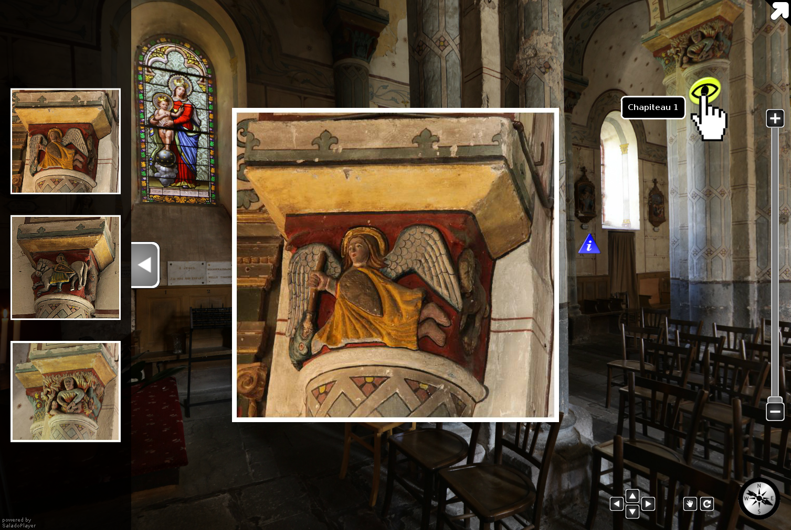
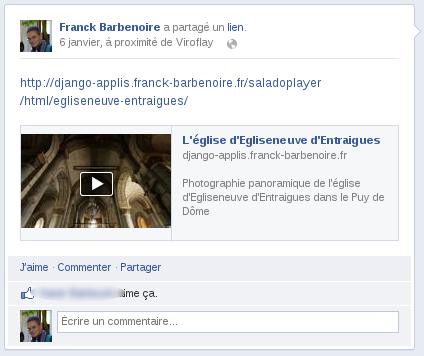
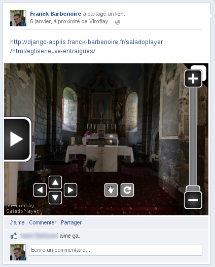

Screenshots
===========

Here is some screenshots from the administration interface :

- Tour configuration :

.. image:: images/tour.png

- Panorama configuration :

- Panorama hotspot configuration :

.. image:: images/chaining.png

- Information hotspot configuration :

.. image:: images/information.png

- Gallery hotspot configuration :

- The saladoplayer gallery of hotspot images installed by default. You can change them.

.. image:: images/album-saladoplayer.png

Example results :

- an image button is displayed when cliking on an image belonging to the gallery attached to a panorama (see "Panorama configuration" above)

- a gallery is displayed when clicking on an image belonging to a gallery (among many one) attached to the panorama (see "Gallery hotspot configuration" above)

Result  on Facebook :

